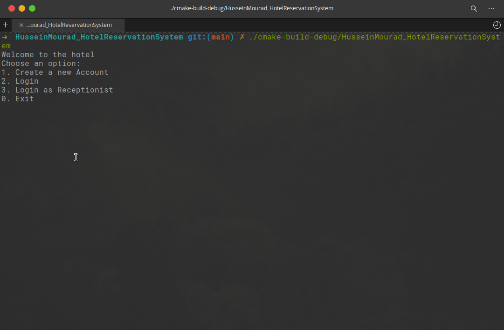

# Hotel System

This is a hotel system where there are multiple types of guests and multiple types rooms. Each user type can only
reserve a room with its time.

## Acknowledgement

This software is developed and tested on linux by clion.

## Demo



## Features

- User can create an account.
- User can log in by id.
- User can reserve a room or multiple or rooms.
- User can reserve his reservation.
- User can cancel reservation for a room or multiple of rooms.
- User can order extra services: dry cleaning and spa.
- User can get his invoice.
- Receptionist can get all available rooms.
- Receptionist can get all occupied rooms.
- Receptionist can get list of all guests.
- Receptionist can get guests information (number of rooms, number of nights, total cost).

## Running locally

```bash
$ ./cmake-build-debug/HusseinMourad_HotelReservationSystem 
```